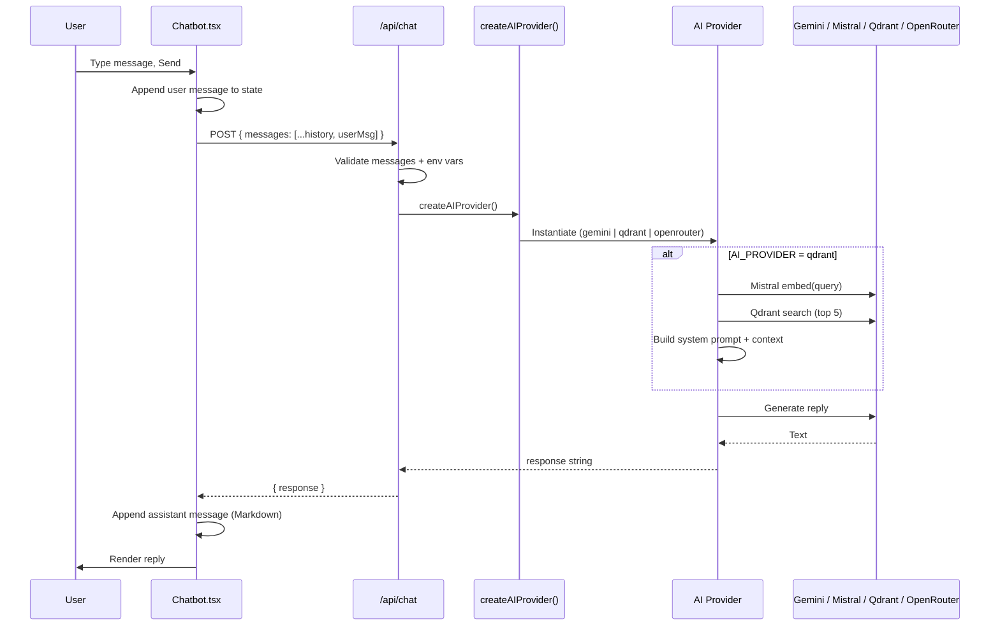

# Portfolio AI Chatbot — How It Works

This document explains how **Zohaib's AI Assistant** is built, how a message travels from the browser to the model, and how to configure or extend it.

---

## Overview

The chatbot is a **floating widget** on the portfolio home page. Visitors ask questions about experience, skills, projects, certifications, and contact info. Answers are generated on the server via **Next.js API route** `POST /api/chat`, using a **pluggable AI provider** selected by environment variables.

| Layer | Role |
|-------|------|
| **UI** | `components/Chatbot.tsx` — chat panel, message list, markdown rendering |
| **API** | `app/api/chat/route.ts` — validates input, checks env, calls provider |
| **Providers** | `lib/ai/providers/*` — Gemini, OpenRouter, or Qdrant RAG |
| **Knowledge (RAG)** | Supabase tables → embeddings → Qdrant vector search |

The portfolio **sections** (Hero, Projects, etc.) load content from Supabase for display. The chatbot can use the **same Supabase data** when `AI_PROVIDER=qdrant`, after you sync vectors with `scripts/sync-to-qdrant.mjs`.

---

## End-to-end flow



---

## 1. Frontend (`components/Chatbot.tsx`)

**Mounting:** Imported and rendered once at the bottom of `app/page.tsx`, so it appears on every visit to the home page.

**State:**

- `isOpen` — toggle floating button vs chat window
- `messages` — array of `{ role, content }` (`ChatMessage` from `lib/ai/providers/base.ts`)
- `input` — current text field
- `isLoading` — disables send while waiting

**Initial message:** A hard-coded assistant greeting (markdown) suggesting topics: experience, stack, certifications, projects, contact.

**Sending a message (`handleSend`):**

1. Guard: empty input or already loading → return
2. Push user message to `messages`
3. Clear input, set `isLoading = true`
4. `fetch("/api/chat", { method: "POST", body: JSON.stringify({ messages: [...messages, userMessage] }) })`
   - Sends the **full conversation** including the new user turn (and the welcome message as prior `assistant` history)
5. On success: append `{ role: "assistant", content: data.response }`
6. On failure: append a friendly fallback mentioning `mzohaib0677@gmail.com`
7. `isLoading = false`

**UX details:**

- Enter (without Shift) sends; Shift+Enter would need a textarea change (currently single-line `input`)
- Auto-scroll to bottom on new messages (`messagesEndRef`)
- **Framer Motion** for open/close, typing dots, button pulse
- **ReactMarkdown** on assistant (and user) bubbles with custom components for `p`, lists, `strong`, `code`
- Styling uses theme tokens (`chatbot-surface`, `glass-strong`, `--amber`, etc. in `globals.css`)

**Security note:** API keys never touch the browser. Only message text is sent to your own `/api/chat` route.

---

## 2. API route (`app/api/chat/route.ts`)

**Method:** `POST` only (Next.js App Router route handler).

**Request body:**

```json
{
  "messages": [
    { "role": "user" | "assistant" | "system", "content": "..." }
  ]
}
```

**Steps:**

1. Parse `messages`; if missing or not an array → `400`
2. Normalize each item to `ChatMessage` (`role` defaults to `"user"`, `content` to `""`)
3. **`getMissingChatEnvVars()`** (`lib/ai/chat-env.ts`) — provider-aware check:
   - `gemini` → needs `GEMINI_API_KEY`
   - `openrouter` → needs `OPENROUTER_API_KEY`
   - `qdrant` → needs `QDRANT_URL`, `QDRANT_API_KEY`, `MISTRAL_API_KEY`, plus generator key (`GEMINI_API_KEY` or `OPENROUTER_API_KEY` per `RAG_GENERATOR`)
4. **`createAIProvider()`** → call `provider.chat(chatMessages)`
5. Return `{ response: string, meta: ChatResponseMeta }` or `{ error, details? }` with `500`

**`meta` fields (always returned on success):**

| Field | Meaning |
|-------|---------|
| `source` | `semantic_cache` \| `rag_llm` \| `gemini` \| `openrouter` |
| `cached` | `true` = answer from Qdrant cache, no LLM call |
| `ragChunks` | How many vectors retrieved from `portfolio_vectors` |
| `ragTopScore` | Best similarity score from RAG search |
| `cacheScore` | Similarity when `cached: true` |
| `cacheMatchedQuery` | Original question that was cached |
| `generator` | `gemini` or `openrouter` (when `source` is `rag_llm`) |
| `latencyMs` | Server processing time |

Errors are logged server-side; in development, extra `details` may be returned.

---

## 3. Provider abstraction

### Contract (`lib/ai/providers/base.ts`)

```ts
interface AIProvider {
  chat(messages: ChatMessage[]): Promise<string>;
}

interface ChatMessage {
  role: "user" | "assistant" | "system";
  content: string;
}
```

The UI and API route only depend on this interface. Swapping backends means implementing `AIProvider` and wiring it in the factory.

### Factory (`lib/ai/providers/index.ts`)

Reads **`AI_PROVIDER`** (default: `gemini`):

| Value | Class | When used |
|-------|--------|-----------|
| `gemini` | `GeminiProvider` | Default; needs `GEMINI_API_KEY` |
| `openrouter` | `OpenRouterProvider` | If `OPENROUTER_API_KEY` set; else warn + fallback |
| `qdrant` | `QdrantMistralRAGProvider` | If Qdrant + Mistral env set; else warn + fallback |

**Fallback:** If the chosen provider cannot initialize, the factory falls back to **`GeminiProvider`** when `GEMINI_API_KEY` exists; otherwise it throws.

---

## 4. Provider implementations

### 4.1 Gemini (`lib/ai/providers/gemini.ts`) — default & RAG generator

- SDK: `@google/generative-ai`
- Model: **`gemini-2.5-flash`** (`temperature: 0.7`, `maxOutputTokens: 8192`)
- **System prompt:** Built-in portfolio persona (role, skills, projects, certifications, contact) unless a message with `role: "system"` is present — then the **last system message** in the array wins (used by RAG to inject retrieved context).
- **Conversation:** Last **6** messages formatted as `User:` / `Assistant:` lines; last **user** message is the active question.
- **Prompt shape:** Single string passed to `generateContent` (not native multi-turn chat API with separate roles).

**Implication for RAG:** `QdrantMistralRAGProvider` prepends `{ role: "system", content: systemPromptWithContext }`. Gemini reads that system block and uses it instead of the default persona — so retrieved Supabase/Qdrant text **does** influence answers.

### 4.2 OpenRouter (`lib/ai/providers/openrouter.ts`)

- Direct `fetch` to `https://openrouter.ai/api/v1/chat/completions`
- Model: `nvidia/nemotron-3-nano-30b-a3b:free`
- Sends the **full `messages` array** with roles preserved (unlike Gemini’s string stitching)
- Optional headers: `HTTP-Referer`, `X-Title` for OpenRouter analytics

Used when `AI_PROVIDER=openrouter`, or as **`RAG_GENERATOR=openrouter`** inside the RAG pipeline.

### 4.3 Qdrant RAG (`lib/ai/providers/qdrant-mistral.ts`)

Enabled with **`AI_PROVIDER=qdrant`**. This is the recommended mode for answers grounded in live portfolio data.

**Per request:**

1. Take the **last user** message as the query.
2. **Embed** once with Mistral `mistral-embed` (shared helper: `lib/ai/mistral-embed.ts`).
3. **Semantic cache lookup** (`lib/ai/semantic-cache.ts`) — search collection `portfolio_semantic_cache` (or `QDRANT_CACHE_COLLECTION`). If cosine **score ≥ `RAG_CACHE_SIMILARITY_THRESHOLD`** (default `0.88`), return the cached answer immediately (**no LLM call**).
4. **RAG search** on `portfolio_vectors` — reuse the same embedding; top `RAG_CONTEXT_LIMIT` hits (default 5).
5. Build **context** from hit payloads: prefer `payload._text`, else `JSON.stringify(payload)`.
6. Compose **system prompt** + call **generator** (Gemini or OpenRouter).
7. **Cache store** — upsert query embedding + response into the semantic cache collection for future similar questions.

**Collections:**

| Collection | Purpose | Populated by |
|------------|---------|--------------|
| `portfolio_vectors` | Portfolio knowledge (skills, projects, etc.) | `node scripts/sync-to-qdrant.mjs` |
| `portfolio_semantic_cache` | Q&A semantic cache | Auto on first chat + each new answer |

Both use **1024-dim** Mistral embeddings, **Cosine** distance. Cache collection is auto-created on first use.

**Cache env vars:**

| Variable | Default | Meaning |
|----------|---------|---------|
| `RAG_CACHE_ENABLED` | `true` | Set `false` to disable semantic cache |
| `QDRANT_CACHE_COLLECTION` | `portfolio_semantic_cache` | Cache collection name |
| `RAG_CACHE_SIMILARITY_THRESHOLD` | `0.88` | Min similarity to return cached answer |
| `RAG_CONTEXT_LIMIT` | `5` | Max RAG chunks per query |

---

## 5. Knowledge base: Supabase → Qdrant

RAG does **not** query Supabase at chat time. It queries **Qdrant**, which must be kept in sync with Supabase.

**Script:** `node scripts/sync-to-qdrant.mjs`

**Source tables:**

- `personal_data`
- `skills`
- `projects`
- `work_history`
- `certifications`
- `education`
- `project_contributions`

**Process per row:**

1. Flatten row to text: `Table: {name}. Content: field: value...` (stored as `_text` in payload)
2. Mistral embedding (with rate-limit sleep/retry)
3. Upsert point into Qdrant with row fields + `_table` + `_text`

**When to re-run:** After you add or edit portfolio rows in Supabase so the chatbot stays accurate.

---

## 6. Configuration

Set variables in `.env` (see `.env.example`). **Never commit real keys.**

### Primary switch

```env
AI_PROVIDER=gemini    # plain LLM, built-in prompt only
AI_PROVIDER=qdrant    # RAG (recommended for production)
AI_PROVIDER=openrouter
```

### RAG-only

```env
RAG_GENERATOR=gemini       # or openrouter
GEMINI_API_KEY=...
MISTRAL_API_KEY=...
QDRANT_URL=...
QDRANT_API_KEY=...
# optional:
QDRANT_COLLECTION=portfolio_vectors
```

### Mode cheat sheet

| Goal | `AI_PROVIDER` | Also required |
|------|----------------|---------------|
| Quick setup, no vector DB | `gemini` | `GEMINI_API_KEY` |
| Answers from Supabase-backed data | `qdrant` | Qdrant + Mistral + generator key; run sync script |
| Alternative LLM, no RAG | `openrouter` | `OPENROUTER_API_KEY` |
| RAG + OpenRouter replies | `qdrant` | Above + `RAG_GENERATOR=openrouter` |

Validation messages for missing vars are human-readable via `chatEnvHumanHint()` in `lib/ai/chat-env.ts`.

---

## 7. Error handling

| Where | Behavior |
|-------|----------|
| API missing env | `500` + `error` + `details` hint |
| API provider throw | `500` + logged stack in dev |
| UI network/API error | Assistant bubble with email fallback |
| RAG embed/search fail | Warning log; answer without retrieved context |
| Factory missing keys | Fallback to Gemini or throw |

---

## 8. File map

```
app/
  api/chat/route.ts          # POST handler
  page.tsx                   # <Chatbot />
components/
  Chatbot.tsx                # Client UI
lib/ai/
  chat-env.ts                # Env validation per provider
  mistral-embed.ts           # Shared Mistral embeddings
  qdrant-client.ts           # Shared Qdrant client + ensure collection
  semantic-cache.ts          # Qdrant semantic cache (LLM answer reuse)
  providers/
    base.ts                  # AIProvider interface
    index.ts                 # createAIProvider()
    gemini.ts
    openrouter.ts
    qdrant-mistral.ts
scripts/
  sync-to-qdrant.mjs         # Supabase → Qdrant sync
.env.example                 # Template for all AI vars
```

---

## 9. Dependencies (npm)

| Package | Used for |
|---------|----------|
| `@google/generative-ai` | Gemini |
| `@qdrant/js-client-rest` | Vector search |
| `react-markdown` | Message rendering |
| `framer-motion` | Panel animations |

OpenRouter uses native `fetch` (no dedicated SDK in the provider file).

---

## 10. Limitations & extension ideas

- **No streaming:** Full response returned in one JSON body; UI shows loading dots until complete.
- **No server-side rate limiting** on `/api/chat` (consider middleware or edge limits for production abuse).
- **Conversation length:** Gemini uses last 6 messages; RAG generator gets last 5 after system. Very long chats may drop early context.
- **OpenRouter + RAG:** System role is honored by OpenRouter; Gemini merges system into a single prompt — both work today via different mechanisms.
- **Welcome message** is sent to the API as part of history (increases tokens slightly).

**To extend:** Add a new class implementing `AIProvider`, branch in `createAIProvider()`, extend `getMissingChatEnvVars()`, and document new env vars in `.env.example`.

---

## 11. Quick test checklist

1. `npm run dev` — open site, click chat FAB (bottom-right).
2. Send a question — watch Network tab for `POST /api/chat`.
3. If `500` + missing env → fix `.env` per `AI_PROVIDER`.
4. For RAG: run `node scripts/sync-to-qdrant.mjs`, then ask something specific from Supabase (e.g. a project title).
5. Toggle `AI_PROVIDER` and restart dev server to compare plain Gemini vs RAG.

---

## Related docs

- `README.md` — high-level chatbot bullet
- `PROJECT_REFERENCE.md` — section 5 (AI architecture); some env notes may lag behind `chat-env.ts`
- `DEPLOYMENT.md` — troubleshooting chat on Vercel/Netlify
- `.env.example` — authoritative env template
